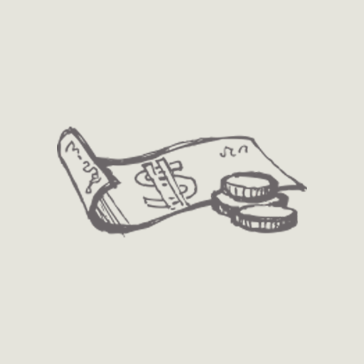
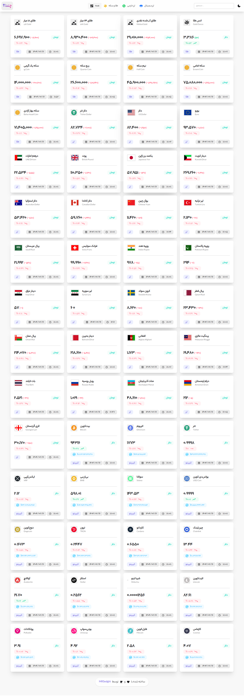
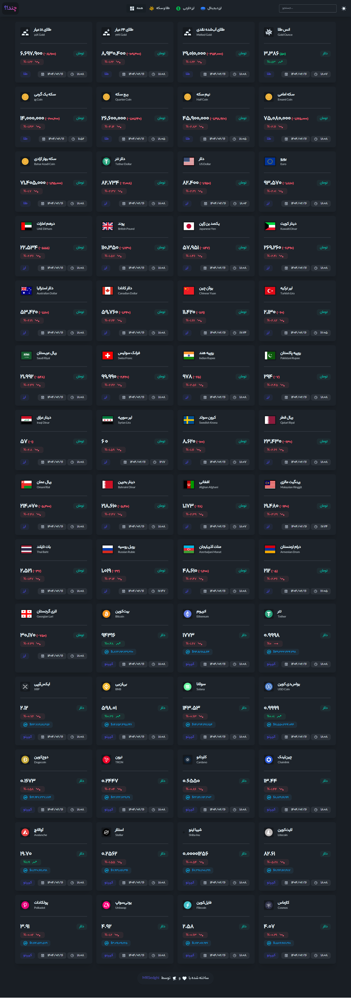

  
  
  #  Chand!? - ردیاب بازارهای مالی
  
  
  
  
  
  
  
  
  
  
  
  

  
  ## 📜 درباره پروژه
  
  **چند؟** یک ابزار ردیاب بازارهای مالی شامل قیمت طلا، ارز و ارزهای دیجیتال با رابط کاربری مدرن و واکنش‌گرا می‌باشد. این پروژه با استفاده از React و TailwindCSS توسعه داده شده است.
  
  

  
  ## 🌟 Features
  
  - 📊 Real-time market data tracking
  - 💎 Gold prices (18K, 24K, coins)
  - 💵 Currency exchange rates
  - ₿ Cryptocurrency prices
  - 🌙 Dark/Light mode
  - 📱 Fully responsive design
  - 🔍 Powerful search functionality
  
  

  
  ## 🛠️ فناوری‌های استفاده شده
  
  

  
  

    
  

  
  

  
  ## 📸 تصاویر
  
  | حالت روز | حالت شب |
  |----------|----------|
  |  |  |
  
  

  
  ## 💖 Support
  

  
  ### حمایت از پروژه
  

  
  

  
  

  
  ###  Iranian Support
  
  
  

  
  

  
  ### 💳 Crypto Donations
  
   **TRX**:  
  `TXkEs7BHRtV6ffof79Ty92AJW1jYrFRUSY`
  
  

  
  

  
  

    
<i>Your support helps maintain and improve this project! ❤️</i>

  

  
  ## 📜 License
  

  
  ### مجوز پروژه
  

  
  

    
    
This project is licensed under the MIT License - see the <a href="LICENSE">LICENSE</a> file for details.

  

  
  ## 📬 Contact
  

  
  ### تماس با ما
  

  
  

  
  

  
  **MohammadReza Sedghi**  
  <small>Project Maintainer</small>
  
  

  
  

  
  -  [@mrsedghi](https://t.me/mrsedghi)
  -  m.r.sedghii@gmail.com
  -  [mrsedghi](https://github.com/mrsedghi)
  
  

  
  

  
  

    
Made with ❤️ and ☕ 

  

